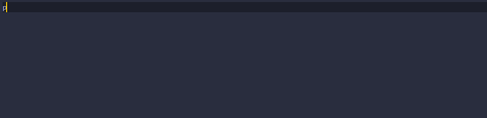

# VSCode-Snippets
All my (small) collection of custom snippets for VS Code.
### How to install a snippets
Download the snippet and copy it in the path
```bash
C:\Users\{USER}\AppData\Roaming\Code\User\snippets
```

### Placeholder 
This is my most used placeholder size for images, 350x150.
Placeholder used : [placeholder.com](https://placeholder.com/)
```html
  
```
### PlaceholderCustom
Created for Skat, with this snipet you enter the width & height that you need
Placeholder used : [placeholder.com](https://placeholder.com/)
```html

```

### Placeholder500x200
Just a random one. Placeholder used : [placeholder.com](https://placeholder.com/)

